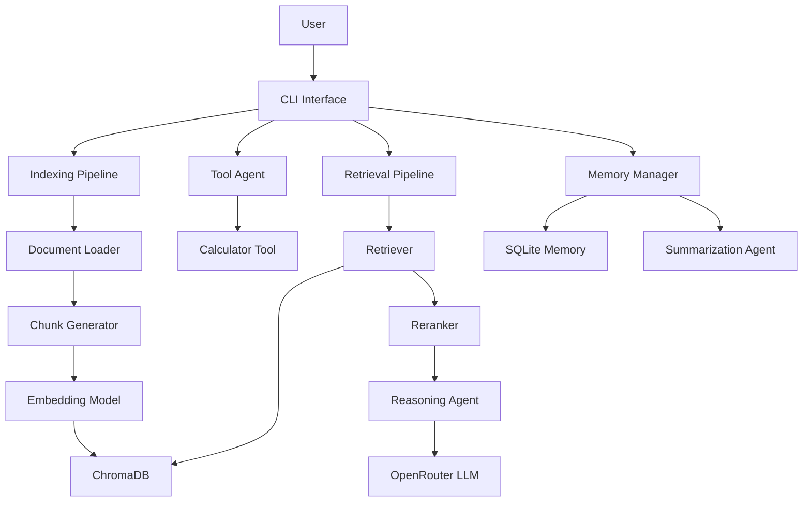

# System Architecture

## High-Level Architecture

---

## Architecture Layers

### Presentation Layer

Handles user interaction through the command-line interface.

Components:

* main.py

---

### Ingestion Layer

Responsible for document processing.

Components:

* DocumentLoader
* TextExtractor
* TableExtractor
* ChunkFactory
* TableSummarizer
* TextChunker

Responsibilities:

* Extract text
* Extract tables
* Generate chunks
* Create metadata

---

### Embedding Layer

Converts chunks into vector representations.

Components:

* BaseEmbedding
* SentenceTransformerEmbedding

Responsibilities:

* Generate embeddings
* Normalize vectors

---

### Vector Storage Layer

Stores vectorized document chunks.

Components:

* BaseVectorDB
* ChromaDB

Responsibilities:

* Persist vectors
* Similarity search

---

### Retrieval Layer

Finds relevant information for answering questions.

Components:

* Retriever
* Reranker

Responsibilities:

* Vector retrieval
* Candidate ranking

---

### Agent Layer

Coordinates reasoning and decision-making.

Components:

* ReasoningAgent
* SummarizationAgent
* ToolAgent

Responsibilities:

* Answer generation
* Conversation summarization
* Tool selection

---

### Tool Layer

Executes deterministic operations.

Components:

* BaseTool
* CalculatorTool
* ToolRegistry

Responsibilities:

* Tool execution
* Tool management

---

### Memory Layer

Stores conversation history.

Components:

* EpisodicMemory
* MemoryRepository
* MemoryManager

Responsibilities:

* Save interactions
* Retrieve history
* Generate summaries

---

### LLM Layer

Generates final responses.

Components:

* BaseLLM
* OpenRouterLLM

Responsibilities:

* Prompt execution
* Response generation
